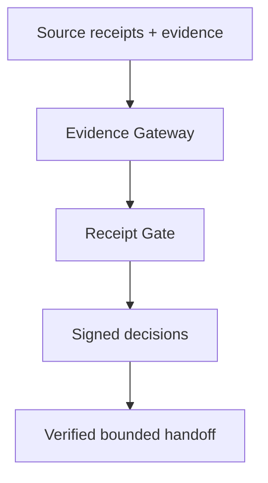

# OpenLine Lite

[](https://github.com/terryncew/openline-lite/actions/workflows/ci.yml)
[](https://www.python.org/)
[](LICENSE)

**Keep the receipts. Stop replaying the whole run.**

OpenLine Lite is a local Python stack for verified, bounded AI-agent handoffs. It verifies a native receipt chain, tests the receipts' evidence under receiver-owned policy, and emits a small JSONL projection for the next model. It is aimed at indie developers who want lightweight accountability without carrying an entire transcript into every prompt.

No server. No database. No network fetcher. No producer-supplied `verified` flag is trusted.

## The bang-for-buck claim

OpenLine Lite does **not** promise token savings on every run. Verification metadata has a fixed cost. Its included benchmark measures where bounded handoffs begin to beat full-history replay.

Reference result using `tiktoken:cl100k_base`, three visible claims, and synthetic deterministic traces:

| Tested depth | One next handoff | Cumulative handoff at every step |
|---:|---:|---:|
| 1 | 27.7% more tokens | 27.7% more tokens |
| 2 | 10.2% fewer tokens | 2.8% more tokens |
| 4 | 43.7% fewer tokens | 24.8% fewer tokens |
| 8 | 71.8% fewer tokens | 54.0% fewer tokens |
| 16 | 85.8% fewer tokens | 74.3% fewer tokens |
| 32 | 92.9% fewer tokens | 86.3% fewer tokens |

In this fixture, the first tested one-handoff break-even is depth 2; the first cumulative break-even is depth 4. Those are workload-specific measurements, not universal constants. Run the benchmark on your traces before making a cost claim.

The separate nine-case policy fixture produced **9/9 correct OpenLine Lite dispositions** versus **3/9 for a signature-only baseline**. This tests receiver decisions such as commit, quarantine, and deny. It does not test whether an LLM answer becomes more accurate or useful. Each event's evidence is checked when its gate decision is issued; the handoff does not claim to reduce that evidence work.

See [BENCHMARK.md](BENCHMARK.md) and the machine-readable [reference result](benchmarks/results/reference-cl100k.json).

## Run it in two minutes

```bash
python -m venv .venv
. .venv/bin/activate
pip install .

olp-lite demo
olp-lite benchmark --depths 1,2,4,8,16,32 --iterations 20
```

For model-token counts instead of the dependency-free lexical counter:

```bash
pip install '.[benchmark]'
olp-lite benchmark \
  --depths 1,2,4,8,16,32 \
  --iterations 20 \
  --tokenizer tiktoken:cl100k_base \
  --out benchmark.json
```

## What runs locally



- **Evidence Gateway:** preserves the exact source bytes, recomputes signature integrity, checks externally pinned producer trust, and normalizes supported formats.
- **Receipt Gate:** checks action policy, freshness, committed evidence bytes, and explicit receiver-owned claim rules; then signs `COMMIT`, `QUARANTINE`, `DENY`, `NO_BADGE`, or `ROLLBACK_REQUEST`.
- **Chain verifier:** verifies sequence, run, issuer, parent linkage, signatures, and pinned producer keys for a complete native run.
- **Handoff projection:** includes only sources with valid receiver decisions under an exact policy-hash allowlist. A conflicting eligible non-commit decision excludes the source.

The complete receipts and evidence stay outside the model prompt. The JSONL handoff is a bounded projection, not a replacement for retained evidence.

## The hostile control

```text
complete                → VERIFIED / COMMIT
signed_but_unsupported  → REJECTED / DENY
```

Both source receipts are validly signed and contain every committed evidence byte. In the second case the evidence says `{"found":false}` while receiver policy requires `/found == true`. A valid signature therefore cannot smuggle an unsupported conclusion into the next handoff.

The decision layer keeps these checks separate:

| Layer | Receiver-side operation | Result |
|---|---|---|
| Integrity | Recompute Ed25519 signature over deterministic JSON | pass / fail / unavailable |
| Provenance | Compare signer with external pinned trust | pass / fail / unavailable |
| Normalization | Map a supported source format without upgrading trust | pass / fail / unavailable |
| Policy | Check the action type under receiver policy | pass / fail / unavailable |
| Freshness | Evaluate source time at the receiver | pass / fail / unavailable |
| Evidence | Recompute required evidence hashes | pass / fail / unavailable |
| Claim support | Replay bounded JSON Pointer equality rules | pass / fail / unavailable |

Any failed check produces `REJECTED`. Any unavailable check produces `UNDECIDABLE`. Only an all-pass assessment can produce `VERIFIED / COMMIT`.

## Create a verified handoff

The manifests are JSON arrays of file paths relative to each manifest:

```bash
olp-lite verify-chain \
  --manifest chain-manifest.json \
  --trust producer-trust.json

olp-lite handoff \
  --chain chain-manifest.json \
  --decisions decisions-manifest.json \
  --producer-trust producer-trust.json \
  --gate-trust gate-trust.json \
  --policy receiver-policy.json \
  --max-claims 3 \
  --out next-agent.jsonl
```

`--policy` is repeatable. Its exact canonical hash authorizes inclusion. A correctly signed decision made under another policy is counted as ignored; it cannot authorize prompt carryover.

For a runnable library example:

```bash
python -m examples.handoff
```

## Bring a foreign receipt

The native format is `olp.source.v1`. A declarative adapter can ingest another Ed25519-signed deterministic-JSON shape without copying its self-declared trust fields:

```bash
olp-lite inspect \
  --source vendor-receipt.json \
  --source-format example.vendor.receipt.v1 \
  --adapter-profile vendor-profile.json \
  --trust trust.json
```

See [conformance/vendor-profile.json](conformance/vendor-profile.json). This mapping layer does not claim compatibility with any named third-party protocol until a version-pinned fixture and conformance test exist.

## Receiver policy

```json
{
  "policy_id": "record-lookup",
  "version": "3",
  "allowed_actions": ["tool_call"],
  "required_evidence": ["tool-output"],
  "claim_rules": [
    {
      "id": "record-found",
      "evidence_id": "tool-output",
      "pointer": "/found",
      "expected": true
    }
  ],
  "max_age_seconds": 300,
  "on_undecidable": "QUARANTINE",
  "rollback_supported": false
}
```

Claim rules are bounded equality checks over strict JSON. They are not semantic truth, natural-language entailment, UCR, or Δhol. An empty rule set is unavailable, never an automatic pass.

## Verification and packaging

```bash
python -m unittest discover -s tests -v
python -m conformance.run
python -m build
```

CI runs linting, 44 adversarial and integration tests on Python 3.10–3.13, the conformance checkpoint, a clean-wheel smoke test, and the `cl100k_base` benchmark. The benchmark JSON is uploaded as a CI artifact.

## Honest boundaries

OpenLine Lite proves that the described local checks ran and that the receiver signed the resulting disposition. It does not prove:

- complete event capture;
- issuer honesty or semantic truth;
- that a policy chose the right facts;
- improved LLM answer quality;
- universal token savings;
- hardware-backed key custody;
- transparency-log inclusion;
- side-effect reversal;
- compatibility with named external receipt protocols;
- production safety.

`ROLLBACK_REQUEST` asks another component to attempt reversal. It does not undo anything itself. The included keys and raw key-file workflow are for local development, not production key management.

Canonical JSON is limited to 128 levels and 100,000 values. Over-limit documents return a canonical validation failure; they never receive a trust or policy decision. JSON Pointer array indexes accept ASCII digits only and reject oversized values before integer conversion.

See [ARCHITECTURE.md](ARCHITECTURE.md), [SECURITY.md](SECURITY.md), [ADOPTION.md](ADOPTION.md), and the exact [release verification](VERIFICATION.md).

MIT licensed. Alpha reference implementation; independent reproduction and security review are welcome.
